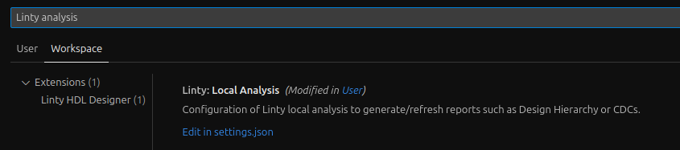
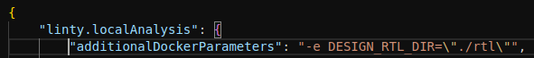

# Linty Configuration

## Linty Scan

### Linter Configuration

Add an [`slang.conf`](slang.conf) file to the root of your repository to tell Linty how to read and elaborate your
project. This [`slang.conf`](slang.conf) file makes Linty read the filelist and set the top module.

Note that you need to define `DESIGN_RTL_DIR` environment variable on your system for
the [filelist](cv32e40p_manifest.flist) to be properly read.

Review the [documentation](https://doc.linty-services.com/doc/scan.html#linter-configuration) for more details.

### BugFinder Configuration

Add the following files to the root of your repository:

* [`read.ys`](read.ys)
* [`hierarchy.ys`](hierarchy.ys)

This makes Linty synthesize your project.

Note that you need to define `DESIGN_RTL_DIR` environment variable on your system for
the [filelist](cv32e40p_manifest.flist) to be properly read.

Review the [documentation]https://doc.linty-services.com/doc/scan.html#bugfinder-configuration) for more details.

### Scan

Review the [documentation](https://doc.linty-services.com/doc/scan.html#configure-linty-scan) to run a scan.

## VS Code

## Real-time Issue Detection Configuration

Note that you need to define `DESIGN_RTL_DIR` environment variable on your system for
the [filelist](cv32e40p_manifest.flist) to be properly read.

## Local Analysis Configuration

Note that you need to pass the `DESIGN_RTL_DIR` environment variable to the Docker container for
the [filelist](cv32e40p_manifest.flist) to be properly read.

To do so:
1. Open settings: <kbd>Ctrl</kbd> + <kbd>Shift</kbd> + <kbd>P</kbd> + `Preferences: Open Settings (UI)`
2. Search for `Linty local analysis` property:

3. Click on `Edit in settings.json`
4. Add `"additionalDockerParameters": "-e DESIGN_RTL_DIR=\"./rtl\""` to `"linty.localAnalysis"`:

Review the [documentation](https://hdl-designer.linty-services.com/) for more details.
